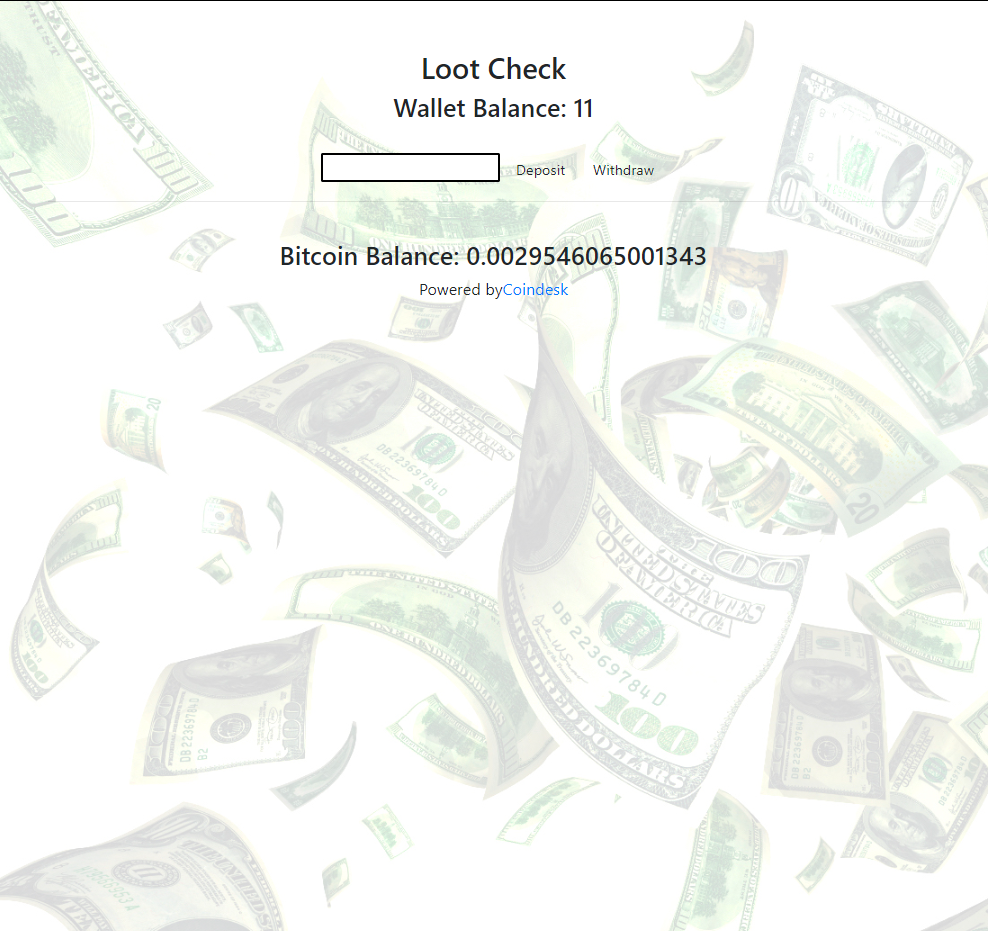
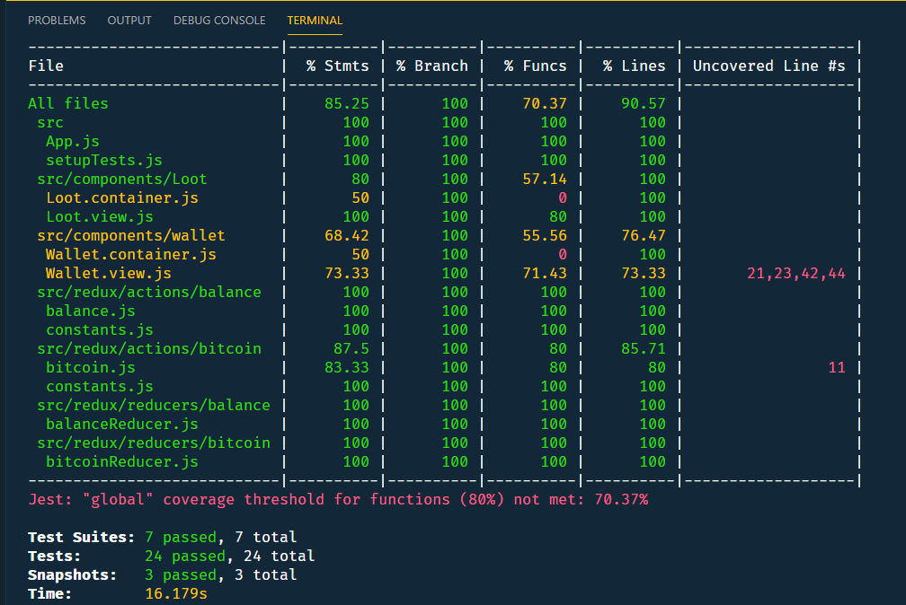

# react-lootCheck

LootCheck is an app that allows a user to *deposit* or *withdraw* into an input field, where LootCheck will convert this value into it's *Bitcoin* value 

This repository follows [David Katz's](https://github.com/15Dkatz) React - Mastering Test Driven Development course on Udemy.

### Objective

 * Learn testing React with Jest and Enzyme
 * Learn testing Redux actions and reducerswith Jest and Enzyme

### Course 

* Course on Udemy : [React Mastering TDD](https://www.udemy.com/react-tdd/)

### Technologies used

* Javascript
* React
* Redux
* React-Bootstrap

### Services used
   * [Coindesk](https://www.coindesk.com/api) - Bitcoin Price Index API

### Build Tools

* [NPM](https://www.npmjs.com/) - Package Manager
* [git](https://git-scm.com/) - Source Control

### Author(s)

* **James Chhun** - [wingchhun](https://github.com/wingchhun)
* **David Katz** - [15Dkatz](https://github.com/15Dkatz)

### Screenshots

